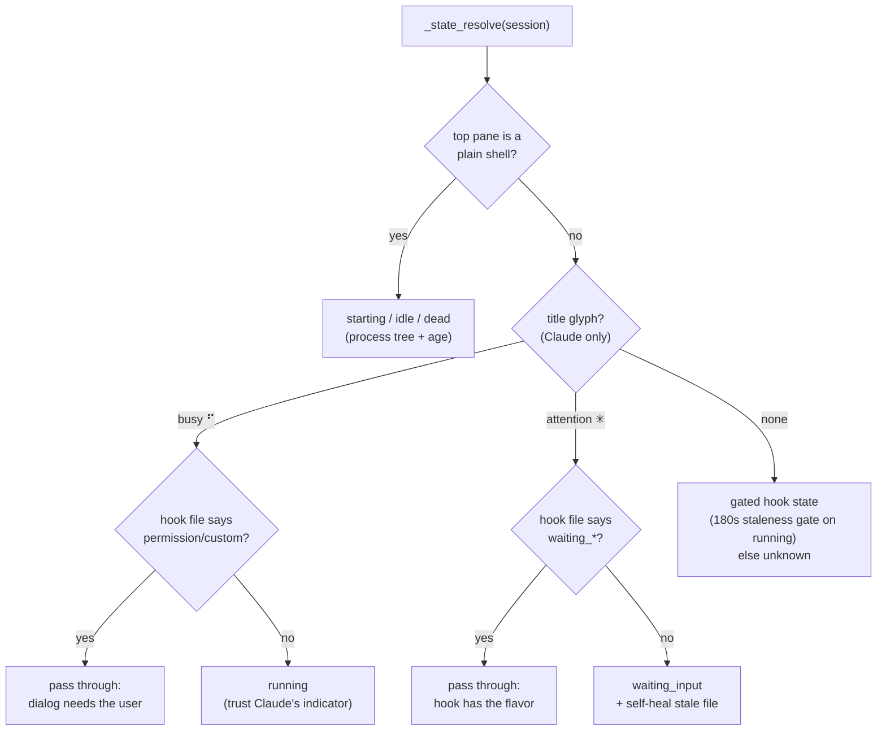
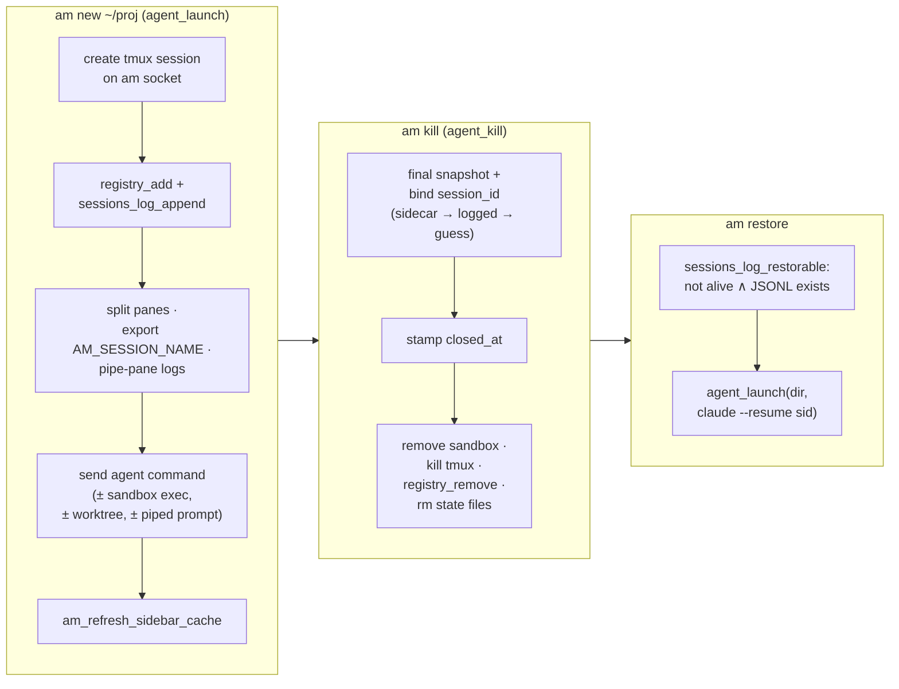

# Agent Manager — Concept Guide

The conceptual model of this codebase: what the main ideas are, how they
depend on each other, and which of them control the system. Organized around
concepts, not files; filenames appear only as evidence. Each material claim
is labeled **verified** (read directly from code/tests/config), **inferred**
(best explanation of verified observations), or **unknown** (open question).

For command reference, key functions, and extension points, see
[AGENTS.md](../AGENTS.md). This page is the layer above it: the ideas those
mechanics implement.

## Big picture

**am is a multiplexer for AI coding agents.** Each agent (Claude Code or
Codex) lives in its own tmux session on a dedicated tmux server, with a
registry of metadata beside it. Around that core, everything serves one
promise: *tell the human — instantly and truthfully — which sessions are
waiting on them*, and give both humans and other agents primitives to
launch, message, observe, kill, and resurrect sessions without attaching.

The intellectual center of gravity is **state detection**: deriving a
nine-value session state from two documented-behavior signals (Claude's
self-maintained pane-title glyph, and lifecycle-hook writes to a state
file) — after a failed generation of pane-content scraping that the
codebase now explicitly forbids.

## Vocabulary and boundaries

| Concept | Definition | Leverage | Evidence | Confidence |
|---|---|---|---|---|
| Session | One agent in one tmux session named `am-<6-hex>`, split into an **agent pane** (top) and **shell pane** (bottom, 15 lines). Both panes export `AM_SESSION_NAME`. | Foundational | `lib/agents.sh:agent_launch` | verified |
| Dedicated tmux server | All am sessions live on socket `agent-manager` (the `am_tmux` wrapper), isolated from the user's own tmux config and sessions. | Foundational | `lib/utils.sh` (`AM_TMUX_SOCKET`), `lib/tmux.sh:am_tmux` | verified (the *why* — config isolation — is inferred from `lib/tmux.sh` comments) |
| State | Nine values: `starting · running · waiting_input · waiting_permission · waiting_custom · waiting_background · idle · unknown · dead`. The product's core datum. | Foundational | `lib/state.sh` | verified |
| Registry | Live-session metadata (dir, branch, agent type, task, flags) in one JSON file. Removed on kill. | Structural | `lib/registry.sh:registry_add` | verified |
| Sessions log | Append-only JSONL afterlife of Claude sessions — the substrate for `am restore` (resume via `claude --resume <sid>`). | Structural | `lib/registry.sh:sessions_log_*` | verified |
| Sandbox | Optional per-session Docker container (agent runs inside; shell pane attaches) with an egress-filtering proxy sidecar. | Structural | `lib/sandbox.sh` | verified |
| Go mirror | Hot-path logic (session list, browser TUI, title refresh, orphan reaping) re-implemented in Go for latency; bash remains the semantic reference. | Structural | `internal/sessions/` | verified |
| A2A primitives | `am new --detach` / `send` / `peek` / `wait`: transport for agent-to-agent orchestration. Deliberately *not* semantic — they move bytes and report state, never interpret task completion. | Structural | `am` help text, AGENTS.md | verified |

## State detection: two honest signals, no scraping

Two signals with complementary strengths are crossed in a decision table
inside `_state_resolve` (`lib/state.sh`) — the **single source of truth**
for state:

- **Title glyph** (liveness). Claude Code itself maintains the terminal
  title: a braille spinner frame (U+2800–U+28FF) while busy, `✳` when it
  needs the user. Event-driven, never goes stale — the only signal that
  survives long quiet tool calls. Answers *busy vs. attention*, nothing
  more.
- **Hook state file** (flavor). Lifecycle hooks (`Stop`, `Notification`,
  `UserPromptSubmit`, `Pre/PostToolUse`, `PermissionRequest`) run
  `lib/hooks/state-hook.sh`, which writes one word to
  `/tmp/am-state/<session>`. Answers *which kind of waiting*.

### Invariants that keep it truthful (all verified)

- **Write only on transitions.** The hook skips same-state rewrites, so the
  state file's *mtime is the state-entry timestamp* — the status bar's
  "waiting for you since 12m" derives directly from it. Any change that
  rewrites the file on every event silently breaks tab ages.
- **Race guards are asymmetric by design.** `waiting_background` is guarded
  *unconditionally* against tool hooks (a background subagent fires
  Pre/PostToolUse for minutes); `waiting_input` gets only a bounded grace
  window (`AM_STATE_GUARD_SECS`, default 10s), because a turn can resume
  without `UserPromptSubmit` and an unconditional guard would pin an active
  session at waiting. `waiting_permission`/`waiting_custom` get *no* guard —
  approval must flip them to running.
- **Session identity resolves precisely, never loosely.** The hook
  identifies its session as `AM_SESSION_NAME` → `TMUX_PANE` → cwd match,
  and if `AM_SESSION_NAME` is set but missing from the registry it *exits*
  rather than fall through and clobber another session sharing the
  directory.
- **Staleness gates are fallback-only.** The 180s gate on a `running` hook
  file applies only when no glyph is readable — both file mtime and tmux
  activity routinely go quiet during live long tool calls.

### Load-bearing prohibition

Earlier revisions scraped pane *content* (banners, mode-line counters,
box-chrome anchoring) as a fourth signal. It misread live turns and flapped
states hundreds of times a day. The title glyph replaced all of it. **Do
not reintroduce pane-content heuristics for state.** Ground truth lives in
`tests/live_lab/`, which drives a real Claude through every state (spends
tokens, ~8 min — run after Claude Code updates or state.sh changes).

Hooks are wired by `scripts/install.sh` (`_install_claude_hooks` into
`~/.claude/settings.json`; `_install_codex_hooks` into a Codex hooks
config). Verified installed live.

## Sources of truth: where state lives, and who may write it

| Store | Path | Tense | Contract |
|---|---|---|---|
| Registry | `~/.agent-manager/sessions.json` | present | Live sessions only. Written by launch/kill/title-scan; read by everything. GC'd against actual tmux sessions (`registry_gc`, mirrored in Go as `ReapOrphans`). |
| Hook state + sid sidecar | `/tmp/am-state/<session>[.sid]` | now | One word per session; **mtime = entry time**. Written by the hook (plus one self-heal in the resolver). The `.sid` sidecar is *authoritative* for the Claude conversation UUID. |
| Sessions log + snapshots | `~/.agent-manager/sessions_log.jsonl` | past | Append-only afterlife. Rolling pane snapshots and session-id backfill feed `am restore`; entries GC'd when the Claude JSONL disappears. |
| Pane logs | `/tmp/am-logs/<session>/{agent,shell}.log` | now | Streamed scrollback via tmux pipe-pane; powers `am peek --follow/--history`. Transport, not truth. |
| Throttle markers & caches | `$AM_DIR/.title_scan_last · .gc_last · .list_cache …` | — | Coordination, not data. Bash and Go share markers; bash-only work runs on *separate* markers (`.gc_extras_last`, `.restore_scan_last`) so Go stamping can't starve it. Hooks delete caches to force fast refresh. |

**Rule of thumb:** registry = present tense, sessions log = past tense,
state dir = right now. A new fact's tense decides its store.

## Representative flows: birth, death, resurrection

Failure behavior worth knowing (verified): if the sandbox is requested but
Docker is missing, launch **rolls back** (kills tmux, removes registry
entry). At kill time, a session-id *guess* may never overwrite a binding
established while hooks were alive — the sidecar wins, then the
already-logged sid, then a guarded newest-mtime guess that refuses when two
sessions share a directory.

## Performance doctrine: the bash/Go mirror and the fork budget

Correctness logic is written once in bash; the *hot paths* — session list
(`am-list-internal`), browser TUI (`am-browse`), title refresh, orphan
reaping — are mirrored in Go under `internal/sessions/`. Two disciplines
keep the mirror honest:

- **Shared markers, split responsibilities.** Both sides throttle on the
  same files, but work only bash does runs on its own markers so the Go
  side stamping first can't starve it.
- **Fork-frugality in bash.** The status bar runs on the attach hot path;
  it resolves state for all sessions from *bulk fixtures* (one `ps`, one
  tmux call, nameref maps into `_state_resolve`) and lookup tables instead
  of subshells. Adding a `$( )` per session there is a felt regression.

Schema changes to the registry or sessions log must move the Go structs
(`internal/sessions/sessions.go`) in the same commit.

## Containment: a session with walls

`am new --sandbox` gives the session a per-session Docker container: the
agent pane runs *inside* it, the shell pane attaches via a reconnecting
loop, and a shared home (`~/.agent-manager/sandbox-home`) bind-mounts as
`/home/ubuntu`. Egress is filtered: each container gets its own network
plus a **tinyproxy sidecar** with a domain filter list
(`lib/sandbox.sh:_sandbox_start_proxy`). The container runs as `ubuntu`
(UID-aligned to the host) with passwordless `apt-get` only — full sudo
needs `SB_UNSAFE_ROOT=1`. Container lifecycle is slaved to session
lifecycle (created in launch, removed in kill, orphans GC'd).

## Change hotspots: if you touch X, Y moves

| You change… | …what else moves |
|---|---|
| State semantics (`_state_resolve`, hook mapping) | Status-bar glyphs and tab ages, `am wait` contracts consumed by orchestrating agents, the AGENTS.md decision table, live-lab expectations. Re-run `tests/live_lab/run.sh`. |
| Hook write behavior | Tab-age timestamps (mtime contract), race guards, list-cache invalidation latency. |
| Registry / sessions-log schema | Both the bash readers *and* the Go structs in `internal/sessions/sessions.go` — same commit. |
| Launch/kill sequence | Restore correctness (sid binding, snapshots), sandbox lifecycle, sidebar refresh latency. |
| Claude Code upgrade lands | Glyph behavior, hook payload shape (`background_tasks` is ≥2.1), title semantics. The live lab exists precisely for this. |

## Honesty ledger: soft spots and open questions

- **inferred** — *Why a dedicated tmux server*: isolation of am's
  config/keybindings/status bar from the user's own tmux. Strongly implied
  by `lib/tmux.sh` comments; no design record states it.
- **unknown** — *Codex state fidelity*: installer machinery for Codex hooks
  exists (`_install_codex_hooks`), and Codex sessions have no title glyph
  (fallback path only), but which lifecycle events Codex actually fires —
  and thus how rich its states get in practice — is unverified.
- **unknown** — *Doc drift risk*: `docs/state-architecture.html` predates
  recent state work; whether it still agrees with `lib/state.sh` has not
  been checked.
- **inferred** — *The tuned constants* (180s staleness gate, 10s guard,
  60s throttles) are empirically tuned via live-lab observation, not
  derived from any Claude Code spec; expect retuning across CLI versions.

## What to own

Three concepts control this system:

1. **The two-signal state contract** — glyph for liveness, hook for flavor,
   decision table as the only merger, pane content forbidden. Every state
   bug and every Claude Code upgrade is judged against this contract.
2. **Tense decides the store** — registry (present) vs. sessions log (past)
   vs. state dir (now), with the sid sidecar as the one authoritative
   identity link between a live session and its resumable conversation.
3. **The mirror discipline** — bash defines semantics, Go buys latency;
   shared markers with split responsibilities, schema changes move both
   sides together.
