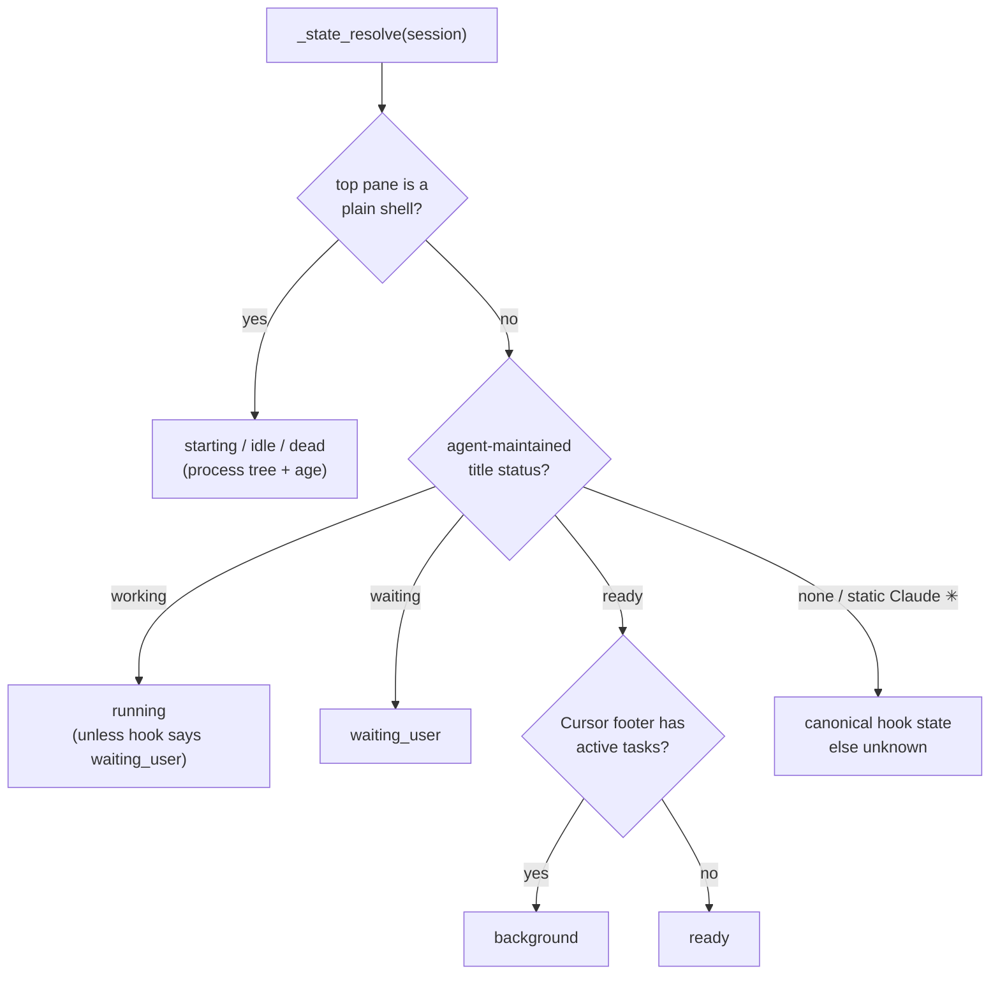
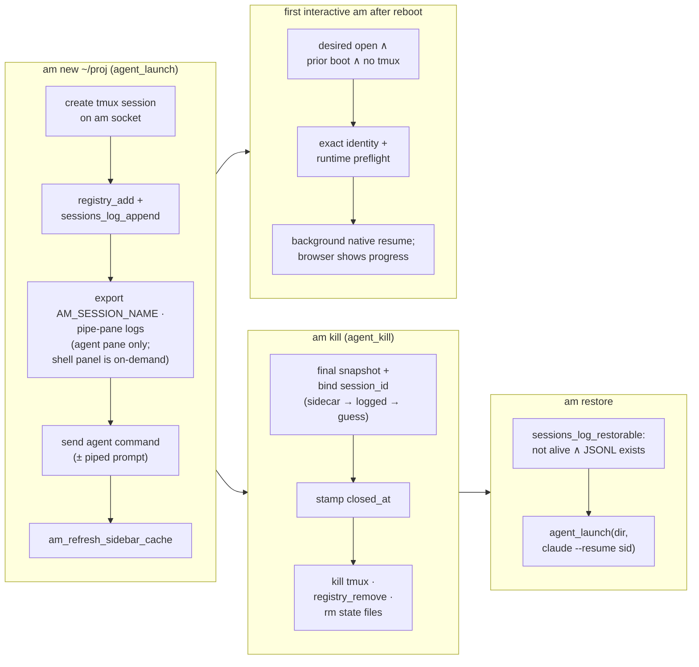

# Agent Manager — Concept Guide

The conceptual model of this codebase: what the main ideas are, how they
depend on each other, and which of them control the system. Organized around
concepts, not files; filenames appear only as evidence. Each material claim
is labeled **verified** (read directly from code/tests/config), **inferred**
(best explanation of verified observations), or **unknown** (open question).

For command reference, key functions, and extension points, see
[AGENTS.md](../AGENTS.md). This page is the layer above it: the ideas those
mechanics implement.

## Big picture

**am is a multiplexer for AI coding agents.** Each Claude, Cursor, Codex, or
pi agent lives in its own tmux session on a dedicated tmux server, with a
registry of metadata beside it. Around that core, everything serves one
promise: *tell the human — instantly and truthfully — which sessions are
working, blocked on them, or ready*, and give both humans and other agents
primitives to launch, message, observe, kill, and resurrect sessions without
attaching.

The intellectual center of gravity is **state detection**: deriving an
eight-value lifecycle state from process ownership, agent-maintained terminal
titles, and lifecycle-hook writes. Broad conversation-content scraping remains
forbidden; Cursor's own structural footer task counter is the sole narrow
exception because Cursor exposes no background-work lifecycle event.

## Vocabulary and boundaries

| Concept | Definition | Leverage | Evidence | Confidence |
|---|---|---|---|---|
| Session | One agent in one tmux session named `am-<6-hex>`: an **agent pane** running full-screen, plus a collapsible **shell panel** (15 lines, below) opened on demand via prefix+` / `am shell` or `--shell` at launch; hiding parks the pane in a hidden `_amshell` window rather than killing it. All panes export `AM_SESSION_NAME`. | Foundational | `lib/agents.sh:agent_launch`, `agent_shell_pane_add` | verified |
| Dedicated tmux server | All am sessions live on socket `agent-manager` (the `am_tmux` wrapper), isolated from the user's own tmux config and sessions. | Foundational | `lib/utils.sh` (`AM_TMUX_SOCKET`), `lib/tmux.sh:am_tmux` | verified (the *why* — config isolation — is inferred from `lib/tmux.sh` comments) |
| State | Eight values: `starting · running · background · waiting_user · ready · idle · unknown · dead`. The product's core datum. | Foundational | `lib/state.sh` | verified |
| Registry | Live-session metadata (dir, branch, agent type, task) in one JSON file. Removed on kill. | Structural | `lib/registry.sh:registry_add` | verified |
| Sessions log | Append-only JSONL afterlife of resumable harness sessions — the substrate for manual native resume through `am restore`. | Structural | `lib/registry.sh:sessions_log_*` | verified |
| Desired sessions | Durable future intent: sessions remain open across reboot until an explicit `am kill`. Reconciled progressively against physical tmux sessions when the interactive browser opens. | Structural | `lib/recovery.sh` | verified |
| Go mirror | Hot-path logic (session list, browser TUI, title refresh, orphan reaping) re-implemented in Go for latency; bash remains the semantic reference. | Structural | `internal/sessions/` | verified |
| A2A primitives | `am new --detach` / `send` / `peek` / `wait`: transport for agent-to-agent orchestration. Deliberately *not* semantic — they move bytes and report state, never interpret task completion. | Structural | `am` help text, AGENTS.md | verified |

## State detection: lifecycle signals, not conversational guesses

Signals with complementary strengths are crossed inside `_state_resolve`
(`lib/state.sh`) — the **single source of truth** for public state:

- **Process ownership** distinguishes an agent process from a shell and yields
  `starting`, `idle`, or `dead` before any activity signal is considered.
- **Lifecycle state files** record `running`, `background`, `waiting_user`, or
  `ready`. Claude/Codex/Cursor hooks and pi's in-process extension write only on
  transitions, so file mtime is the state-entry timestamp.
- **Agent-maintained terminal titles** self-heal missed transitions. Legacy
  Claude versions expose a busy glyph; current Claude's static `✳` only proves
  a fresh process painted its title. Cursor exposes explicit Ready, Working,
  and Waiting-for-you suffixes.
- **Cursor footer task count** refines a Ready title to `background`. This
  matches only Cursor-owned input-footer structure, never response text.

```mermaid
flowchart TD
    A["_state_resolve(session)"] --> B{"top pane is a<br/>plain shell?"}
    B -- yes --> C["starting / idle / dead<br/>(process tree + age)"]
    B -- no --> D{"agent-maintained<br/>title status?"}
    D -- working --> E["running<br/>(unless hook says waiting_user)"]
    D -- waiting --> F["waiting_user"]
    D -- ready --> G{"Cursor footer has<br/>active tasks?"}
    G -- yes --> H["background"]
    G -- no --> I["ready"]
    D -- none / static Claude ✳ --> J["canonical hook state<br/>else unknown"]
```

### Invariants that keep it truthful (all verified)

- **Write only on transitions.** The hook skips same-state rewrites, so the
  state file's *mtime is the state-entry timestamp* — the status bar's
  "waiting for you since 12m" derives directly from it. Any change that
  rewrites the file on every event silently breaks tab ages.
- **Race guards are asymmetric by design.** `background` is guarded
  *unconditionally* against tool hooks (a background subagent fires
  Pre/PostToolUse for minutes); `ready` gets only a bounded grace
  window (`AM_STATE_GUARD_SECS`, default 10s), because a turn can resume
  without `UserPromptSubmit` and an unconditional guard would pin an active
  session at ready. `waiting_user` gets *no* guard — answering the dialog must
  flip it to running.
- **Leftover shells do not count as background work.** `--fork-session` or
  a parent-Claude exit reparents `run_in_background` zsh loops to PID 1.
  Claude still lists them as `status=running` in `background_tasks`. The
  hook ignores a running shell whose matching OS process is not owned by
  this Claude, and a field-less `idle_prompt` may downgrade once a prior
  Stop snapshot's leftovers are all unowned. Unmatched tasks are still
  counted (payload stays authoritative when we cannot verify).
- **Monitors are watchers, not work.** `type=monitor` entries (the Artifact
  tool's live-updates watch, Monitor waits) sit at `status=running` for the
  life of the session and never complete, so nothing would re-fire Stop to
  clear them. The hook never counts them.
- **Session identity resolves precisely, never loosely.** The hook
  identifies its session as `AM_SESSION_NAME` → `TMUX_PANE` → cwd match,
  and if `AM_SESSION_NAME` is set but missing from the registry it *exits*
  rather than fall through and clobber another session sharing the
  directory. Cursor's durable identity is pinned to the first complete
  conversation-id/transcript pair because nested agents inherit
  `AM_SESSION_NAME` and do not reliably identify themselves as background.
- **Staleness gates are fallback-only.** Claude, Cursor, and pi have reliable
  turn-boundary events and are read ungated; the 180s gate applies only to
  other agents. File mtime and tmux activity routinely go quiet during live
  long tool calls.

### Load-bearing prohibition

Earlier revisions classified conversational pane *content* (banners, mode-line
counters, box chrome). It misread live turns and flapped states hundreds of
times a day. **Do not reintroduce broad pane-content heuristics for state.**
The only exception is Cursor's CLI-owned footer task count, structurally
anchored to the newest `→ Add a follow-up` input placeholder (or its captured
border) and consulted only while Cursor's title says Ready. Ground truth lives
in `tests/live_lab/`.

Hooks are wired by `scripts/install.sh` (`_install_claude_hooks` into
`~/.claude/settings.json`; `_install_codex_hooks` into a Codex hooks
config). Verified installed live.

## Sources of truth: where state lives, and who may write it

| Store | Path | Tense | Contract |
|---|---|---|---|
| Registry | `~/.agent-manager/sessions.json` | present | Live sessions only. Written by launch/kill/title-scan; read by everything. GC'd against actual tmux sessions (`registry_gc`, mirrored in Go as `ReapOrphans`). |
| Hook state + sid sidecar | `/tmp/am-state/<session>[.sid]` | now | One word per session; **mtime = entry time**. Written by the hook (plus one self-heal in the resolver). |
| Desired sessions + durable identity | `~/.agent-manager/desired_sessions.json` and `identities/<session>.*` | future | Exact conversation identity, safe launch profile, and user intent to keep a session open. Runtime sidecars are mirrored durably because `/tmp` disappears on reboot. |
| Sessions log + snapshots | `~/.agent-manager/sessions_log.jsonl` | past | Append-only afterlife. Rolling pane snapshots and session-id backfill feed `am restore`; entries GC'd when the Claude JSONL disappears. |
| Pane logs | `/tmp/am-logs/<session>/{agent,shell}.log` | now | Streamed scrollback via tmux pipe-pane; powers `am peek --follow/--history`. Transport, not truth. |
| Throttle markers & caches | `$AM_DIR/.title_scan_last · .gc_last · .list_cache …` | — | Coordination, not data. Bash and Go share markers; bash-only work runs on *separate* markers (`.gc_extras_last`, `.restore_scan_last`) so Go stamping can't starve it. Hooks delete caches to force fast refresh. |

**Rule of thumb:** registry = present tense, sessions log = past tense,
state dir = right now, desired sessions = future intent. A new fact's tense
decides its store.

## Representative flows: birth, death, resurrection

```mermaid
flowchart LR
    subgraph launch["am new ~/proj  (agent_launch)"]
      L1["create tmux session<br/>on am socket"] --> L2["registry_add +<br/>sessions_log_append"]
      L2 --> L3["export AM_SESSION_NAME ·<br/>pipe-pane logs<br/>(agent pane only;<br/>shell panel is on-demand)"]
      L3 --> L4["send agent command<br/>(± piped prompt)"]
      L4 --> L5["am_refresh_sidebar_cache"]
    end
    subgraph kill["am kill  (agent_kill)"]
      K1["final snapshot +<br/>bind session_id<br/>(sidecar → logged → guess)"] --> K2["stamp closed_at"]
      K2 --> K3["kill tmux ·<br/>registry_remove ·<br/>rm state files"]
    end
    subgraph restore["am restore"]
      R1["sessions_log_restorable:<br/>not alive ∧ JSONL exists"] --> R2["agent_launch(dir,<br/>claude --resume sid)"]
    end
    subgraph reboot["first interactive am after reboot"]
      B1["desired open ∧<br/>prior boot ∧ no tmux"] --> B2["exact identity +<br/>runtime preflight"]
      B2 --> B3["background native resume;<br/>browser shows progress"]
    end
    launch --> kill --> restore
    launch --> reboot
```

Failure behavior worth knowing (verified): at kill time, a session-id
*guess* may never overwrite a binding established while hooks were alive — the sidecar wins, then the
already-logged sid, then a guarded newest-mtime guess that refuses when two
sessions share a directory.

## Performance doctrine: the bash/Go mirror and the fork budget

Correctness logic is written once in bash; the *hot paths* — session list
(`am-list-internal`), browser TUI (`am-browse`), title refresh, orphan
reaping — are mirrored in Go under `internal/sessions/`. Two disciplines
keep the mirror honest:

- **Shared markers, split responsibilities.** Both sides throttle on the
  same files, but work only bash does runs on its own markers so the Go
  side stamping first can't starve it.
- **Fork-frugality in bash.** The status bar runs on the attach hot path;
  it resolves state for all sessions from *bulk fixtures* (one `ps`, one
  tmux call, nameref maps into `_state_resolve`) and lookup tables instead
  of subshells. Adding a `$( )` per session there is a felt regression.

Schema changes to the registry or sessions log must move the Go structs
(`internal/sessions/sessions.go`) in the same commit.

## Change hotspots: if you touch X, Y moves

| You change… | …what else moves |
|---|---|
| State semantics (`_state_resolve`, hook mapping) | Status-bar glyphs and tab ages, `am wait` contracts consumed by orchestrating agents, the AGENTS.md decision table, live-lab expectations. Re-run `tests/live_lab/run.sh`. |
| Hook write behavior | Tab-age timestamps (mtime contract), race guards, list-cache invalidation latency. |
| Registry / sessions-log schema | Both the bash readers *and* the Go structs in `internal/sessions/sessions.go` — same commit. |
| Launch/kill sequence | Restore correctness (sid binding, snapshots), sidebar refresh latency. |
| Claude Code upgrade lands | Glyph behavior, hook payload shape (`background_tasks` is ≥2.1), title semantics. The live lab exists precisely for this. |

## Honesty ledger: soft spots and open questions

- **inferred** — *Why a dedicated tmux server*: isolation of am's
  config/keybindings/status bar from the user's own tmux. Strongly implied
  by `lib/tmux.sh` comments; no design record states it.
- **unknown** — *Codex state fidelity*: installer machinery for Codex hooks
  exists (`_install_codex_hooks`), and Codex sessions have no title glyph
  (fallback path only), but which lifecycle events Codex actually fires —
  and thus how rich its states get in practice — is unverified.
- **inferred** — *The tuned constants* (180s staleness gate, 10s guard,
  60s throttles) are empirically tuned via live-lab observation, not
  derived from any Claude Code spec; expect retuning across CLI versions.

## What to own

Three concepts control this system:

1. **The lifecycle state contract** — public states describe what can progress
   (`running`, `background`, `waiting_user`, `ready`), while `_state_resolve`
   alone merges process, hook, and agent-owned title signals. Broad
   conversational pane classification is forbidden.
2. **Tense decides the store** — registry (present) vs. sessions log (past)
   vs. state dir (now), with the sid sidecar as the one authoritative
   identity link between a live session and its resumable conversation.
3. **The mirror discipline** — bash defines semantics, Go buys latency;
   shared markers with split responsibilities, schema changes move both
   sides together.
